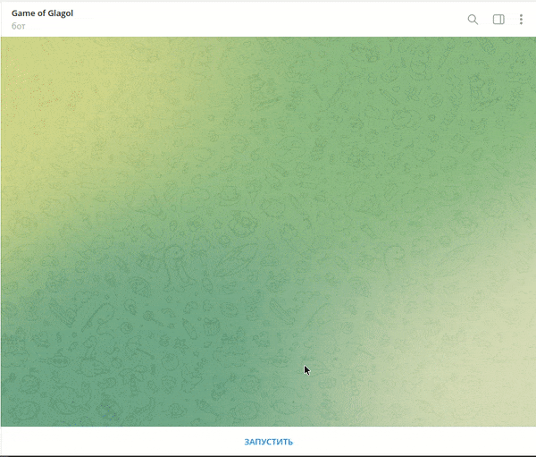
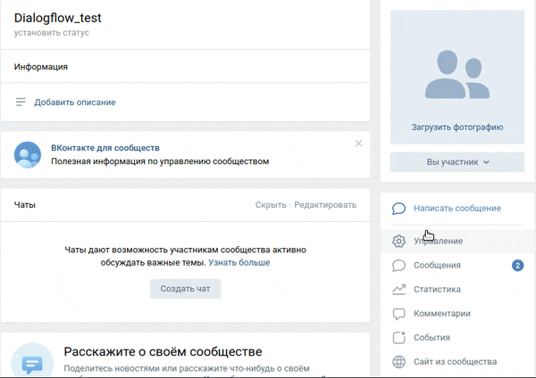

# Бот викторина.

Почувствуй себя участником телешоу "Своя игра". Бот задает вопрос, а ты пытаешься угадать на него ответ. Бот скажет тебе, правильна ли твоя догадка и выдаст новый вопрос.

На текущий момент имеется версия бота с интерфейсом во [вконтакте](https://vk.com/club213818971) и [telegram](https://t.me/glagol_game_bot). Для проверки работы бота во вконтакте, нажмите кнопку `Написать сообщение` в меню сообщества. Для проверки работы бота в telegram, перейдите по ссылке выше и запустите бота.

## Переменные окружения

Необходимые для корректной работы бота токены беруться из переменных окружения. Чтобы их определить, создайте файл `.env` в корневой папке проекта и запишите туда данные в таком формате: `ПЕРЕМЕННАЯ=значение`:

- `TELEGRAM_BOT_TOKEN` — токен вашего телеграм бота, в котором будет проходить викторина. Создать нового телеграм бота и получить токен можно у [BotFather](https://telegram.me/BotFather).
- `VK_TOKEN` — токен вашего бота во вконтакте, в котором будет проходить викторина. Чтобы создать нового бота во вконтакте и получить токен, [создайте новую группу вконтакте](https://vk.com/groups?tab=admin) и в разделе `Работа с API` настроек группы, создайте новый ключ. Добавьте полученный ключ как значение текущей переменной. Также разрешите боту отправлять сообщения от имени группы в подразделе `Настройки для бота`, раздела `Сообщения` в меню созданной группы.

- `QUESTIONS_ANSWERS_PATH` — укажите путь к файлу вопросов и ответов, которые будут загружены для проведения викторины. По умолчанию используются тестовые вопросы и ответы расположенные в файле `quiz_questions/3f15.txt`.

- `TELEGRAM_LOGGER_BOT_TOKEN` — токен вашего телеграм бота, в который будут приходить все логи работы ботов. Создать нового телеграм бота и получить токен можно у [BotFather](https://telegram.me/BotFather). После создания бота, запустите его, перейдя по сгенерированной ссылке и нажав кнопку `start`.
- `TELEGRAM_DEVELOPER_USER_ID` — id пользователя, кому бот будет присылать все логи работы ботов. Получить свой id можно у [этого телеграм бота](https://telegram.me/userinfobot).

- `REDIS_URL` — укажите путь к базе данных [Redis](https://redis.io/). По умолчанию, если [redis server установлен локально](https://www.digitalocean.com/community/tutorials/how-to-install-and-secure-redis-on-ubuntu-18-04-ru) url будет вида: `redis://localhost:6379`.

## Как запустить

- Для запуска сайта вам понадобится Python третьей версии.
- Скачайте репозиторий с кодом и прилегающими файлами.
- Установите зависимости командой `pip install -r requirements.txt`.
- Убедитесь что вы создали и наполнили файл `.env` по инструкции разделом выше.
- Запустите бота в telegram командой `python3 tg_bot.py`.
- Запустите бота во вконтакте командой `python3 vk_bot.py`.

## Как задеплоить бота на Heroku

- Скопируйте себе на github [репозиторий проекта](https://github.com/rimprog/quiz-bot).
- Зарегистрируйтесь и перейдите в раздел apps на сайте [Heroku](https://dashboard.heroku.com/apps).
- Нажмите кнопку `NEW`, а затем в выпадающем меню нажмите `Create new app`. Вы попадете на [страницу](https://dashboard.heroku.com/new-app) создания нового приложения.
- Заполните все необходимые данные и нажмите кнопку `Create app`.
- Через [графическое меню heroku](https://dashboard.heroku.com/apps/) откройте созданное приложение и в settings добавьте переменные окружения `.env` в `Config Vars`.
- Откройте созданное приложение и перейдите в раздел `Deploy`.
- В подразделе `Deployment method` выберите свой скопированный `GitHub` репозиторий проекта и подключите его.
- Перейдите в подраздел `Manual deploy` и выбрав нужную ветку, нажмите кнопку `Deploy Branch`.
- Для настройки `redis` на сервере, через [графическое меню heroku](https://dashboard.heroku.com/apps/) зайдите на вкладку `Resources`. В строке поиска `Add-ons`, найдите `Heroku Redis` и кликнув на него, нажмите кнопку `Submit`.
- Ваше приложение готово к работе. Если приложение по какой-то причине не запустилось, проверьте [логи](https://devcenter.heroku.com/articles/logging#view-logs) вашего приложения и устраните указаннную ошибку.

## Цели проекта

Код написан в учебных целях — это урок в курсе по Python и веб-разработке на сайте [Devman](https://dvmn.org).
